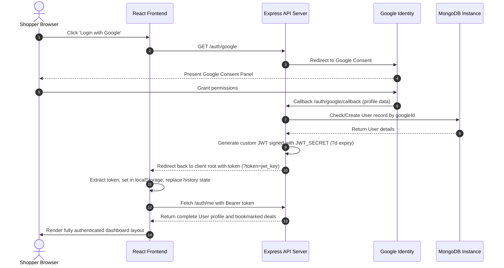
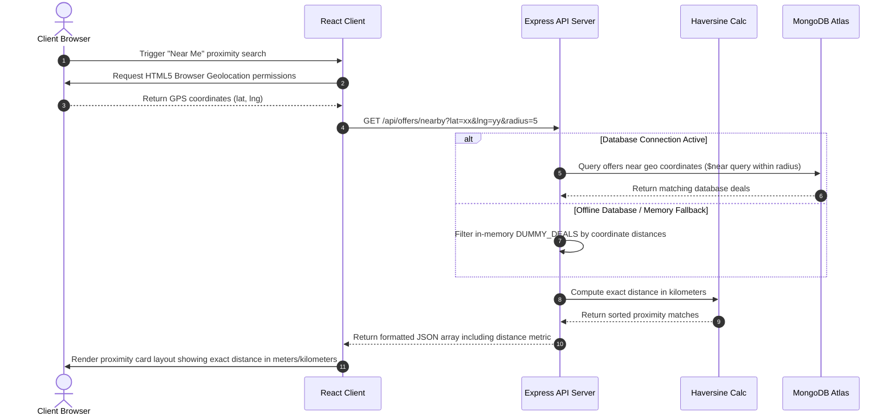

# 🌌 Buyoffer (Lots of Offers) — Codebase Technical Manual

Welcome to the **Buyoffer (Lots of Offers)** technical guide. This document serves as the high-fidelity developer blueprint and system architecture manual for the Deals Aggregation and Location-based Discovery Platform.

---

## 📋 1. Project Purpose & Core Value Proposition

**Buyoffer** is a highly-optimized, modern, full-stack deals aggregation engine designed to connect consumers with high-value offers across multiple brand networks in India. 

The platform supports:
- 🎯 **Multi-Category Aggregation**: Home services, Travel bookings, Food points, Grocery supplies, and Fashion shopping.
- 📍 **Hyperlocal Geolocation Engine**: Proximity-based filtering utilizing browser GPS, geospatial database indexes (`2dsphere`), and real-time distance rendering (using the Haversine formula).
- 🔗 **Affiliate Integration Hub**: Seamless, standard-compatible redirect links (direct affiliate click-tracking) and Native Third-Party API integrations (e.g., Booking.com search caching).
- 🔐 **Premium Google OAuth & JWT Flow**: High-security user accounts, consent validation, and interactive profiles with personal deal bookmarked archives.
- 🎨 **State-of-the-Art Aesthetic Design**: A custom-crafted React frontend featuring deep dark layouts, glassmorphism overlays, multi-layered color orbs, and dynamic card animations.

---

## 📁 2. Annotated Workspace Map

Here is a map of the file system detailing each major directory and source file's functional role:

```
buyoffer/
├── backend/                       # Node.js + Express API Backend
│   ├── data/
│   │   └── seedOffers.js          # Core seed data containing 30 initial Indian brand deals
│   ├── models/
│   │   ├── Click.js               # Mongoose schema for user affiliate click tracking
│   │   ├── Offer.js               # Mongoose schema for deals (supports 2dsphere index)
│   │   └── User.js                # Mongoose schema for user profiles and bookmark relations
│   ├── routes/
│   │   └── auth.js                # Google OAuth Strategy, JWT validation, and saved deal routes
│   ├── scripts/
│   │   └── seed.js                # Database seeder execution script
│   ├── services/
│   │   └── googlePlaces.js        # Google Places API client for geolocational coordinates resolution
│   ├── utils/
│   │   └── distance.js            # Haversine formula utility for client-to-deal metric distances
│   ├── .env                       # Backend local configuration credentials (JWT, MongoDB, API Keys)
│   ├── package.json               # Backend npm package list (express, mongoose, passport, jwt)
│   └── server.js                  # Main server entrypoint (routers, dummy storage fallback, Booking.com API)
│
├── frontend/                      # React + Vite Client-side Application
│   ├── src/
│   │   ├── components/            # Reusable state-aware UI elements
│   │   │   ├── AuthModal.jsx      # Glassmorphic auth modal (tabbed Google OAuth & manual inputs)
│   │   │   ├── BookingWidget.jsx  # Compact reservation/detail widget for hotel cards
│   │   │   ├── ConsentModal.jsx   # Interactive legal/cookie compliance banner on initial load
│   │   │   ├── NearMeButton.jsx   # GPS location query trigger
│   │   │   ├── ProfileDashboard.jsx# Multi-tab customer hub (Profile stats, Saved Deals, settings)
│   │   │   ├── RadiusSelector.jsx # Range picker for proximity queries
│   │   │   └── Skeleton.jsx       # Grid loader placeholders
│   │   ├── hooks/
│   │   │   └── useAuth.js         # Custom authentication state hooks (localStorage, API Sync)
│   │   ├── App.css                # CSS Variables, light/dark themes, and design tokens
│   │   ├── App.jsx                # Main Application Shell (search, filtering, category bar, offers grid)
│   │   ├── index.css              # Global styles, fonts and resets
│   │   └── main.jsx               # React 19 entry bootstrap
│   ├── .env                       # Vite environment configurations (VITE_API_URL)
│   ├── index.html                 # Root document markup
│   ├── package.json               # Frontend dependencies (lucide-react, React 19)
│   └── vite.config.js             # Vite build settings
│
├── MD files/                      # Project architectural specifications
│   ├── AFFILIATE_GUIDE.md         # Affiliate configuration notes
│   ├── DATABASE.md                # DB structure guidelines
│   ├── DESIGN_SYSTEM.md           # UI/UX typography and palettes
│   ├── MVP.md                     # Minimum Viable Product roadmap
│   ├── NEARME_SPEC.md             # NearMe GPS functional specifics
│   ├── PRD.md                     # Product Requirements Document
│   └── TECH_ARCH.md               # Technical Architecture guidelines
│
├── CODEBASE.md                    # THIS FILE - Core system overview
├── README.md                      # Basic installation and usage summary
└── context.md                     # High-level project implementation logs
```

---

## 📦 3. Technology Stack & Necessary Dependencies

This project relies on a modern MERN-like stack (MongoDB, Express, React, Node.js) supplemented with Vite and native CSS for high performance. Below are the key installed dependencies and necessary files.

### Frontend Dependencies (`frontend/package.json`)
* **React 19 (`react`, `react-dom`)**: The core UI library used for rendering the single-page application.
* **Vite (`vite`, `@vitejs/plugin-react`)**: A fast build tool and development server.
* **Lucide React (`lucide-react`)**: Provides the SVG icon system used throughout the interface (e.g., `CheckCircle`, `Flame`, `MapPin`, `Search`, `Plane`, `Utensils`).
* **ESLint & Vitest (`eslint`, `vitest`, `jsdom`)**: Dev dependencies for code linting and testing environments.

### Backend Dependencies (`backend/package.json`)
* **Express (`express`)**: The core web framework for building the API endpoints.
* **Mongoose (`mongoose`, `mongodb`)**: The ODM (Object Data Modeling) library for MongoDB, used to define schemas (`Offer`, `User`, `Click`) and perform queries like `$near` geospatial searches via `2dsphere` indexes.
* **Passport & Google OAuth20 (`passport`, `passport-google-oauth20`)**: Manages the authentication strategy for "Login with Google".
* **JSON Web Token (`jsonwebtoken`)**: Generates custom JWTs for secure session management without relying solely on cookies.
* **Express Rate Limit (`express-rate-limit`)**: Protects endpoints (like `/api/clicks`) from abuse and brute-force attacks.
* **Cors & Dotenv (`cors`, `dotenv`)**: Essential middlewares for cross-origin resource sharing and environment variable management.
* **Express Session (`express-session`)**: Necessary for initializing Passport sessions during the OAuth flow.

### Key Configuration Files
* **`.env` (Frontend & Backend)**: Essential uncommitted files that store sensitive data like `MONGODB_URI`, `JWT_SECRET`, `GOOGLE_CLIENT_ID`, and API keys for Booking.com.
* **`vite.config.js`**: Controls how the frontend bundle is built and served.
* **`server.js`**: The main entrypoint for the backend, setting up the Express app, connecting to MongoDB, integrating Booking.com proxy APIs, and serving dummy deals in-memory when the database is unavailable.

---

## 🏗️ 4. System Architecture Blueprint

This diagram illustrates the flow of requests from the user’s browser to our React App, local API backend, MongoDB store, and external networks:

```mermaid
graph TD
    %% Clients
    subgraph Browser ["Client-Side Web Application (React 19)"]
        UI["React Layout Components"]
        useAuth["useAuth Custom Hook"]
        CSS["App.css Design Token System"]
    end

    %% Gateway
    subgraph Backend ["Server-Side API Engine (Express / Node.js)"]
        Server["server.js (Main App Listener)"]
        AuthRouter["routes/auth.js (Google OAuth & JWT)"]
        Seed["scripts/seed.js"]
        Distance["utils/distance.js (Haversine Calculations)"]
        Places["services/googlePlaces.js"]
    end

    %% Storage
    subgraph DB ["Database Storage"]
        Mongo["MongoDB Atlas / Local Server"]
        SchemaUser["User Schema (savedDeals ref)"]
        SchemaOffer["Offer Schema (2dsphere index)"]
        SchemaClick["Click Schema"]
    end

    %% External
    subgraph External ["External Third-Party APIs"]
        GoogleOAuth["Google Identity Servers"]
        BookingAPI["Booking.com (RapidAPI Proxy)"]
        GooglePlacesAPI["Google Places API"]
    end

    %% Connections
    UI -->|1. REST Queries / Actions| Server
    useAuth -->|2. Get Session / Register| AuthRouter
    
    Server -->|3. Geospatial / Search Queries| Mongo
    AuthRouter -->|4. Update Bookmarks / Retrieve Profiles| Mongo
    Seed -->|5. Populate Initial Records| Mongo
    
    Server -->|6. Calculate Metric Proximity| Distance
    Server -->|7. Proxy Search Caching| BookingAPI
    Places -->|8. Fetch Area Details| GooglePlacesAPI
    AuthRouter -->|9. Authenticate Callback redirect| GoogleOAuth
```



---

## 🗄️ 5. Database Blueprint & Schemas

The database leverages three closely related Mongoose schemas, utilizing indexing mechanisms to support scalable geolocational searches and quick text retrieval.

### A. The Offer Model (`backend/models/Offer.js`)
Stores detailed meta-information for the aggregated offers. Crucially implements a MongoDB **2dsphere** index to allow geospatial querying.

* **Geospatial Hook**: Computes a standard GeoJSON Point dynamically inside the `pre('validate')` hook if the coordinates (`lat`, `lng`) are provided.
* **Database Indexes**:
  - `category`: Fast categoric filtering.
  - `location.coordinates` & `location.geo`: Geospatial sphere indexing.
  - `text` Index (`$**`): Multi-field text indexes for full search terms coverage.

```javascript
// Schema snippet showing coordinate pre-hook mapping
offerSchema.pre('validate', function setGeoPoint() {
  const coords = this.location && this.location.coordinates;
  if (coords && Number.isFinite(coords.lat) && Number.isFinite(coords.lng)) {
    coords.type = 'Point';
    coords.coordinates = [coords.lng, coords.lat];
    this.location.geo = {
      type: 'Point',
      coordinates: [coords.lng, coords.lat]
    };
  }
});
```

### B. The User Model (`backend/models/User.js`)
Manages registered shopper credentials and connects profiles to saved bookmarks:
- `googleId`: Unique ID returned from the Google Identity server.
- `savedDeals`: An array of references populated from the `Offer` schema, enabling quick rendering of bookmarked offer feeds.

### C. The Click Model (`backend/models/Click.js`)
Tracks the click-out redirect history for affiliate billing, storing the user ID, clicked offer ID, brand category, target link, and a timestamp.

---

## 📡 6. Backend Service & Endpoint Blueprint

The backend `server.js` starts the listener on port `5000` (or `process.env.PORT`) and manages routing, authentication hooks, and fallbacks.

### A. Dynamic Mock Data & Real Brands Generator
To ensure highly populated categories even without a database, the server aggregates **30 high-fidelity dummy deals** alongside an automated category generator. It scans a list of **50+ famous Indian food, grocery, and travel brands** (e.g., Zomato, Swiggy, Zepto, Blinkit, BigBasket) and injects active offers with custom-calculated dynamic discounts.

### B. Native Booking.com API Integration
If a client queries travel offers, `server.js` can hook directly into the Booking.com RapidAPI. It performs a multi-step fetch:
1. Resolves the requested city name into a **Destination ID** via locations lookup.
2. Queries live lodging discount prices for tomorrow.
3. Automatically maps the API's custom object structure into our internal `OfferCard` JSON schema so the frontend can render third-party listings identically to local database offers.

### C. Complete Endpoint Directory

| Method | Endpoint | Description | Middleware / Params |
| :--- | :--- | :--- | :--- |
| **GET** | `/api/health` | API Status & Active Mode check | None |
| **GET** | `/api/offers` | Main filtered deals aggregator query | `category`, `state`, `city`, `q` (query) |
| **GET** | `/api/offers/search` | Core keyword search & client-side filter proxy | `q` (keyword term), price filters |
| **GET** | `/api/offers/nearby` | Proximity detection query | `lat`, `lng`, `radius` (in km) |
| **GET** | `/api/locations` | Comprehensive nested Indian hierarchy | Pre-populated states, cities, and major areas |
| **POST** | `/api/clicks` | Records an affiliate click-out | Rate-limited (Max 30 clicks / 15 minutes) |
| **GET** | `/auth/google` | Starts Google Sign-in redirection flow | Passport strategy |
| **GET** | `/auth/google/callback` | OAuth redirect callback handler | Returns custom JWT on callback URL |
| **GET** | `/auth/me` | Fetches signed-in user stats and bookmarks | JWT verification middleware |
| **POST** | `/auth/save-deal/:offerId` | Bookmarks an offer ID for a specific user | JWT verification |
| **DELETE**| `/auth/save-deal/:offerId`| Deletes a bookmarked deal | JWT verification |

---

## 🎨 7. Frontend Core Architecture

The frontend is a lightweight Single Page Application powered by **React 19** and **Vite**.

### A. The Core Styling System (`App.css`)
Written entirely in vanilla CSS using highly modular custom variables. The style system supports dynamic light and dark modes with sleek animations:
- **Design Tokens**: Defined in `:root` (light) and `[data-theme="dark"]` (dark).
- **Aesthetic Accents**: Sticky glassmorphic menus (`backdrop-filter`), rotating gradient backgrounds, and multi-colored floating glow orbs (`orb1`, `orb2`, `orb3`) positioned on the hero layout.

### B. State Management & Hooks (`useAuth.js`)
Instead of heavy Redux wrappers, user session lifecycle is kept clean through a tailored hook:
- **JWT Storage**: Managed via browser `localStorage`.
- **Query Callback Sync**: When redirecting from the Google callback URL, the hook extracts the token parameters from `window.location.search`, stores the token, updates the user context state, and seamlessly replaces browser history with standard roots.
- **Bookmarks Sync**: Provides clean methods for component state updates like `saveDeal` with active HTTP Bearer headers.

### C. Glassmorphism UI Component Suite
- **ConsentModal.jsx**: Displays custom terms & conditions and privacy terms. Blocks browser viewport scroll until accepted.
- **AuthModal.jsx**: Split-panel layout. Left pane renders custom branding features while the right pane holds tabbed input fields, complete with password visibilities and Google Login buttons.
- **ProfileDashboard.jsx**: Elegant sliding dashboard displaying member parameters, settings toggles (weekly alerts and newsletters), and lists of user-bookmarked deals.

---

## 🔄 8. Detailed Key Workflows

### A. Authentication & Custom JWT Session Flow



### B. Hyperlocal Proximity & Location Filtering Flow



---

## 🛠️ 9. Developer Setup & Reference

### A. Environment Configuration

Ensure the following configuration parameters are added to your workspace environment:

#### Backend Environment Settings (`backend/.env`)
```ini
PORT=5000
MONGODB_URI=mongodb+srv://<user>:<password>@cluster.mongodb.net/
SESSION_SECRET=your_express_session_random_secret
JWT_SECRET=your_jwt_signature_secret
CLIENT_URL=http://localhost:5173

# Third-Party External APIs Keys (Optional)
GOOGLE_CLIENT_ID=your_google_oauth_client_id.apps.googleusercontent.com
GOOGLE_CLIENT_SECRET=your_google_oauth_client_secret
GOOGLE_PLACES_API_KEY=your_places_api_key
BOOKING_COM_API_KEY=your_rapidapi_booking_com_key
```

#### Frontend Environment Settings (`frontend/.env`)
```ini
VITE_API_URL=http://localhost:5000
```

### B. Commands Directory

To spin up the ecosystem locally, execute these commands inside your terminal:

#### 1. Backend Server Bootstrap
```bash
cd backend
npm install
npm run dev
```
*App launches on: [http://localhost:5000](http://localhost:5000)*

#### 2. Database Seeding Setup (MongoDB Atlas)
Ensure your MongoDB local instance is running, or whitelist your IP address inside your Atlas console, then trigger:
```bash
cd backend
node scripts/seed.js
```

#### 3. Frontend Client Bootstrap
```bash
cd frontend
npm install
npm run dev
```
*App launches on: [http://localhost:5173](http://localhost:5173)*

---

## 🚀 10. Future Technical Roadmap

To take this platform to enterprise scale, the following architectural upgrades are recommended:
1. **Caching Layer**: Integrate **Redis** key-value caches on `/api/offers` and native Booking.com endpoints to speed up subsequent queries and avoid RapidAPI rate limits.
2. **Automated Deal Scraper**: Implement a background job runner (using **BullMQ** or **agenda**) to schedule web scraper workers every 6 hours, updating active discounts inside the database.
3. **Advanced GIS Operations**: Enhance MongoDB indexing to search within custom geospatial polygons representing dynamic delivery zones for local grocery/food brands.
4. **Push Notifications**: Integrate web push notification managers to alert authenticated users immediately when their saved deals are within 12 hours of expiring.

---

*© 2026 Lots of Offers (Buyoffer). Built with high-performance React, Express, and Modern Geospatial DB Architectures.*
